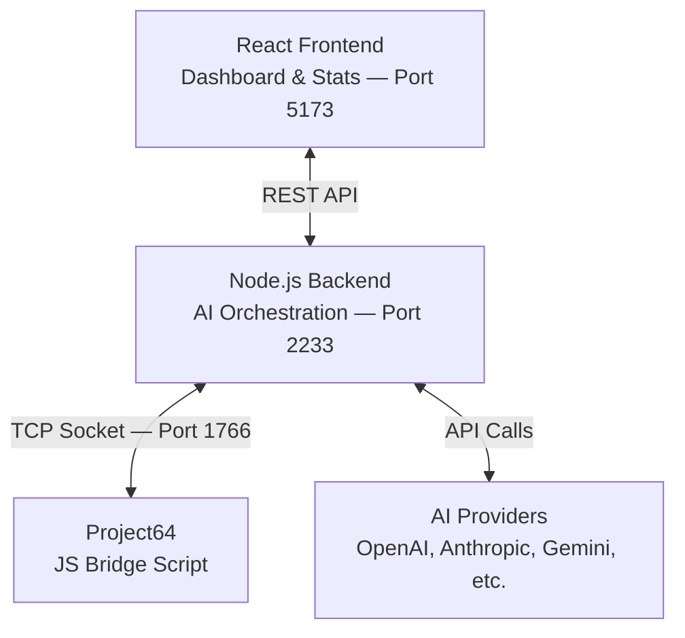

# Pokemon Stadium 2 — AI Benchmark (PokeBench)

<p align="center">
  
  
  
  
</p>

An open-source platform that pits two AI models against each other in real-time **Pokemon Stadium 2** battles on the N64, via the **Project64** emulator.

It supports a wide range of providers — OpenAI, Anthropic, Google Gemini, DeepSeek, Mistral, and OpenRouter — and exposes a live dashboard to watch the action, read each AI's reasoning, and track statistics over time. Built for benchmarking, streaming, and entertainment.

---

## Table of Contents

- [Features](#features)
- [Architecture](#architecture)
- [Requirements](#requirements)
- [Quick Start](#quick-start)
- [Project64 Script Console Setup](#project64-script-console-setup)
- [Project Structure](#project-structure)
- [Configuration](#configuration)
- [Troubleshooting](#troubleshooting)
- [License](#license)

---

## Features

- **Multi-provider AI support** — Connect any combination of OpenAI, Anthropic, Google Gemini, DeepSeek, Mistral, and OpenRouter models.
- **Reasoning model controls** — Configure chain-of-thought effort levels (low / medium / high / max) for models that support advanced reasoning.
- **Real N64 gameplay** — Reads game memory and injects controller inputs through Project64's JavaScript scripting API. No simulation; the AI plays the actual game.
- **Live dashboard** — A React frontend to monitor battles in real time, view each AI's decision-making process, and browse historical statistics.
- **ROM patcher** — A bundled script that patches your legally obtained ROM to unlock all rental Pokemon and apply move modifications for balanced AI battles.
- **Flexible battle formats** — Singles, Best of 3, Best of 5, with team sizes of 3v3 or 6v6.

---

## Architecture

The system is composed of three layers that communicate over the network:



| Component | Role |
|---|---|
| **Project64 + Bridge Script** | Runs the patched ROM. A JavaScript bridge script (`pokemon_stadium2_server.js`) exposes a TCP server on port `1766`, giving the backend read/write access to game memory and controller inputs. |
| **Node.js Server** | Central orchestrator. Connects to the emulator bridge, calls AI provider APIs to generate teams and choose moves, and manages the full battle lifecycle. Exposes a REST API on port `2233`. |
| **React Frontend** | Control panel and live viewer. Lets you pick models, configure battle settings, start matches, and visualize the battle state as it unfolds. Polls the backend for real-time updates. |

**Data flow in a nutshell:**

1. The user selects two AI models and a battle format from the dashboard.
2. The backend asks each AI to draft a team, then sends the corresponding inputs to the emulator.
3. During battle, the bridge script reads the current game state (active Pokemon, HP, moves, etc.) from memory and sends it to the backend.
4. The backend forwards the state to the active AI, which picks a move. The backend translates that into controller inputs and sends them to the emulator.
5. This loop continues until a winner is determined. Statistics are recorded after each match.

---

## Requirements

| Requirement | Details |
|---|---|
| **Operating system** | Windows 10 or 11 |
| **Emulator** | [Project64](https://www.pj64-emu.com/) with JavaScript scripting support. If your build does not support scripts, use a [nightly dev build](https://www.pj64-emu.com/nightly-builds). |
| **Runtime** | [Node.js](https://nodejs.org/) v20.19 or later |
| **ROM** | A legally obtained, uncompressed dump of **Pokemon Stadium 2 (USA)** in `.z64` format |
| **API keys** | At least one key from a supported provider (OpenAI, Anthropic, Google, DeepSeek, OpenRouter, or Mistral) |

---

## Quick Start

### 1. Install dependencies

From the project root, install packages for both the backend and the frontend:

```bash
cd server
npm install

cd ../frontend
npm install
```

### 2. Configure environment variables

Create the backend configuration file and fill in your API keys:

```bash
cd ../server
copy .env.example .env
```

Open `server/.env` and set at least one provider key:

```env
PORT=2233

OPENAI_API_KEY=sk-...
ANTHROPIC_API_KEY=sk-ant-...
GOOGLE_API_KEY=...
DEEPSEEK_API_KEY=...
OPENROUTER_API_KEY=...
MISTRAL_API_KEY=...
```

### 3. Set up Project64 files

Copy two items from this repository into your Project64 installation:

1. **Save data** — Copy the folder `pj64_data/save/POKEMON STADIUM 2-3FF6104CCFDD84728B1C1DAAF3A7D945` into your Project64 `Saves/` directory. Copy the entire folder, not just its contents.

2. **Bridge script** — Copy `pj64_data/scripts/pokemon_stadium2_server.js` into your Project64 `Scripts/` directory.

### 4. Patch the ROM

Place your legally obtained `Pokemon Stadium 2 (USA).z64` inside the `scripts/` folder, then run:

```bash
cd scripts
node patch_pokemon_stadium2.js "Pokemon Stadium 2 (USA).z64"
```

> Expected base ROM MD5: `1561c75d11cedf356a8ddb1a4a5f9d5d`

The patcher will produce a new file: `Pokemon Stadium 2 (USA) [Moves Modded + All rental Pokemons].z64`

### 5. Launch (in order)

The components must be started in the following sequence:

1. **Emulator** — Open Project64 and load the **patched** ROM.
2. **Bridge script** — In Project64, open the Scripts menu and run `pokemon_stadium2_server.js`.
3. **Backend** — Start the Node.js server:
   ```bash
   cd server
   node index.js
   ```
4. **Frontend** — Start the React development server:
   ```bash
   cd frontend
   npm run dev
   ```
5. **Dashboard** — Open [http://localhost:5173](http://localhost:5173) in your browser. Select your AI models, choose a battle format, and start the benchmark.

---

## Project64 Script Console Setup

Use these settings to make sure Project64 can run scripts such as `pokemon_stadium2_server.js`.

### Required settings

1. Open `Options > Configuration`.
2. Uncheck `Hide advanced settings`.
3. Optional: uncheck `Pause emulation when window is not active` for easier debugging.


4. Open the `Advanced` tab.
5. Check `Enable Debugger`.
6. Optional: check `Always use interpreter core`. This is required for some events interface functions, but it may reduce game performance.


### Script console usage

1. Open `Debugger > Scripts...`.


2. Click `...` to open the scripts directory in the file explorer. Only JavaScript (`*.js`) files in the root of that folder are shown in the console.
3. Start or stop a script by double-clicking it, or by selecting it and clicking `Run/Stop`.
4. While a script is active, select it and enter code in the input box at the bottom of the window. Entered code is evaluated in that script instance (the namespace is not shared between instances). Use the up and down arrow keys to navigate input history.
5. To start a script automatically when Project64 launches, right-click it and choose `Autorun...`.


---

## Project Structure

```text
pokemon-stadium-benchmark-open-source/
│
├── server/                # Node.js backend
│   ├── index.js           # Express server, REST API, workflow orchestration
│   ├── GameClient.js      # TCP client for the Project64 bridge
│   ├── battle.js          # Battle state and turn management
│   ├── ai.js              # AI provider integration and prompt handling
│   ├── statsTracker.js    # Match history and statistics
│   ├── modelRegistry.js   # Model definitions and configuration
│   ├── PokeAPIClient.js   # Pokemon data fetcher with local caching
│   ├── prompts/           # Prompt templates sent to AI models
│   ├── data/              # Static data (model configs, Pokemon data)
│   └── .env.example       # Environment variable template
│
├── frontend/              # React + Vite dashboard
│   └── src/
│       ├── App.jsx        # Root component and state management
│       └── components/
│           ├── BenchmarkPage.jsx     # Live battle view
│           ├── StatsPage.jsx         # Statistics and history
│           ├── ModelsAdminPage.jsx   # Model management
│           ├── pokemon/              # Pokemon display components
│           └── ui/                   # Overlays, chat log, screen share
│
├── scripts/               # ROM patching tools
│   └── patch_pokemon_stadium2.js
│
├── pj64_data/             # Files to copy into Project64
│   ├── scripts/           # Bridge script (TCP server inside PJ64)
│   └── save/              # Pre-configured save file (100% completion)
│
├── LICENSE
└── README.md
```

---

## Configuration

### AI Models

Model definitions are stored in `server/data/ai_models.json`. Each entry specifies the model identifier, display name, provider, and optional reasoning parameters. The frontend reads this list to populate the model selection dropdowns.

You can add or remove models through the admin page at [http://localhost:5173/models](http://localhost:5173/models) while the system is running.

### Battle Settings

Battle format and team size are selected from the dashboard before each match:

| Setting | Options |
|---|---|
| Format | Single match, Best of 3, Best of 5 |
| Team size | 3v3, 6v6 |

---

## Troubleshooting

| Problem | Solution |
|---|---|
| **Frontend shows "API disconnected"** | Make sure the backend is running (`node index.js` in `server/`) and that port `2233` is not blocked by a firewall. |
| **Backend cannot connect to the emulator** | Verify that `pokemon_stadium2_server.js` is running inside Project64 and that port `1766` is not in use by another process. |
| **ROM patcher fails with a checksum error** | The base ROM is not the expected version. It must be an uncompressed USA `.z64` dump of Pokemon Stadium 2. |
| **Bridge script does not appear in Project64** | Confirm the file is placed in the correct `Scripts/` directory and that your PJ64 build supports JavaScript scripting (try a nightly build if needed). |

---

## License

This project is licensed under the [Creative Commons Attribution-NonCommercial 4.0 International (CC BY-NC 4.0)](LICENSE).

- You are free to fork, modify, and redistribute this code.
- You must give appropriate credit and link back to this repository.
- Commercial use is not permitted.

> **Disclaimer:** You must provide your own legally obtained ROM. This repository does not include or distribute any copyrighted game data.
